# Adarsh Jaiswal

**Computer Science (AI/ML) student · Full-stack developer · Problem solver**

I build thoughtful web products and explore applied AI, with a focus on clean engineering, practical user experiences, and consistent problem-solving practice.

## Selected work

| Project | What it does | Stack |
| :-- | :-- | :-- |
| [PolishCV](https://github.com/Adarshcode-012/Resume_Enhancer) | AI-assisted resume enhancement platform | FastAPI · React · TypeScript · OpenAI API |
| [ActivityHub](https://github.com/Adarshcode-012/ActivityHub) | Full-stack activity booking platform | Next.js · Node.js · JWT · REST APIs |
| [Voice Shopping Assistant](https://github.com/Adarshcode-012/Voice-shopping-assistant) | Voice-first shopping experience powered by AI | AI · Voice interfaces |

## Core toolkit

  
  
  
  
  
  
  
  
  
  
  

## Problem solving

  

The heatmap is refreshed automatically each day from my public LeetCode calendar.

## Most used languages

  

<!-- The heatmap is generated by GitHub Actions using LeetCode's public GraphQL calendar. -->
